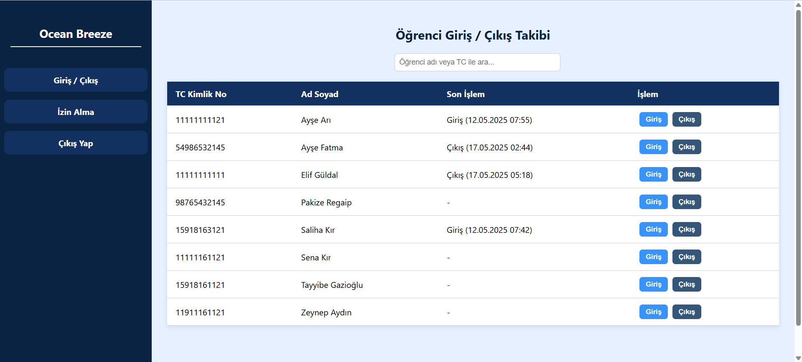

# dormitory_automation 
# Yurt Otomasyon Sistemi - Ocean Breeze

Ocean Breeze, bir öğrenci yurdunun giriş-çıkış, izin ve ödeme süreçlerini web tabanlı olarak yöneten PHP/MySQL tabanlı bir uygulamadır.

## Özellikler

 * ### **Kimlik Doğrulama & Yetkilendirme**
 


-`security` ve `students_affair` rollerine özel güvenli giriş.

* ### **Giriş/Çıkış Takibi**: Çift giriş/çıkış önlenir; her işlem zaman damgasıyla kaydedilir.

* -Çift giriş/çıkış önlenir; her işlem zaman damgasıyla kaydedilir.
* 
* **İzin Yönetimi**: Öğrenciler izin talep edebilir; personel bekleyen talepleri onaylanabilir veya silinebilir. 45 günden fazla izin kullanmış öğrenciler takip edilir.
* **Fatura & Ödeme Modülü**: Öğrencilerin yurt ödemeleri takip edilir; aylık olarak fatura oluşturulur; yeni kayıtlarda o ayın faturası otomatik olarak fatura oluşturma.
* **Öğrenci ekleme**: Yeni öğrenci kaydı yapılır.
* **Öğrenci listeleme**:kayıtlı olan öğrencilerin
* **Öğrenci oda takibi**: Öğrenci yeni eklendiğinde oda ve yatak nosu atanır; isteğe göre oda değişikliği yapılır.


## Teknolojiler

* **Backend**: PHP (PDO)
* **Veritabanı**: MySQL 8.0
* **Frontend**: HTML, CSS,
* **IDE**: Visual Studio Code
* **Yerel Sunucu**: XAMPP (Apache + MySQL)
* **Versiyon Kontrol**: Git & GitHub

## Gereksinimler

* PHP 7.4 veya üzeri
* MySQL 8.0
* XAMPP (ya da benzer LAMP/WAMP)
* Git

## Kurulum

1. **Depoyu kopyalayın**:

   ```bash
   git clone https://github.com/<kullanici-adi>/dormitory_automation.git
   cd dormitory_automation
   ```
2. **Veritabanı yapılandırması**:

   * `dormitory_database` adında bir veritabanı oluşturun:

     ```bash
     mysql -u root -p -e "CREATE DATABASE dormitory_database;"
     ```
   * **Şema (yapı) yüklemesi**:

     ```bash
     # Sadece tablo yapıları, foreign key, trigger ve index tanımlamaları içerir
     mysql -u root -p dormitory_database < schema.sql
     ```
   * **Başlangıç verileri yüklemesi (isteğe bağlı)**:

     ```bash
     # INSERT komutlarıyla kullanıcı, öğrenci ve diğer seed verilerini ekler
     mysql -u root -p dormitory_database < data.sql
     ```
3. **Bağlantı ayarları** `config/db.php` dosyasında güncelleyin:

   ```php
   <?php
   define('DB_HOST', '127.0.0.1');
   define('DB_PORT', '3306');
   define('DB_NAME', 'dormitory_database');
   define('DB_USER', 'root');
   define('DB_PASS', '');
   ```
4. **Sunucuyu başlatın**:

   * XAMPP üzerinden Apache ve MySQL servislerini çalıştırın.
5. **Uygulamayı açın**:

   * Tarayıcıda `http://localhost/dormitory_automation/public/login.php` adresine gidin.

## Kullanım

* **Güvenlik Personeli**:

  * Giriş/çıkış işlemleri ekleyip silebilir.
  * İzin taleplerini görüntüleyip filtreleyebilir.
* **Öğrenci İşleri Personeli**:

  * İzin taleplerini onaylayıp reddedebilir.
  * Yeni öğrenci kaydı ve oda/yatak ataması yapabilir.
  * Fatura oluşturma ve ödeme takibi gerçekleştirebilir.

## Proje Yapısı

```
├── public/                # Giriş ve dashboard sayfaları
├── config/                # Veritabanı bağlantı ayarları
│   └── db.php             # PDO ile bağlantı yapılandırması
├── schema.sql             # Veritabanı şeması (CREATE TABLE, INDEX, TRIGGER tanımları)
├── data.sql               # Başlangıç verileri (INSERT komutları)
├── permissions/           # İzin talepleri modülleri
├── payments/              # Fatura ve ödeme modülleri
├── students/              # Öğrenci kayıt ve yatak atama modülleri
├── security/              # Güvenlik kullanıcı sayfaları
└── assets/                # Görseller, stiller
```
