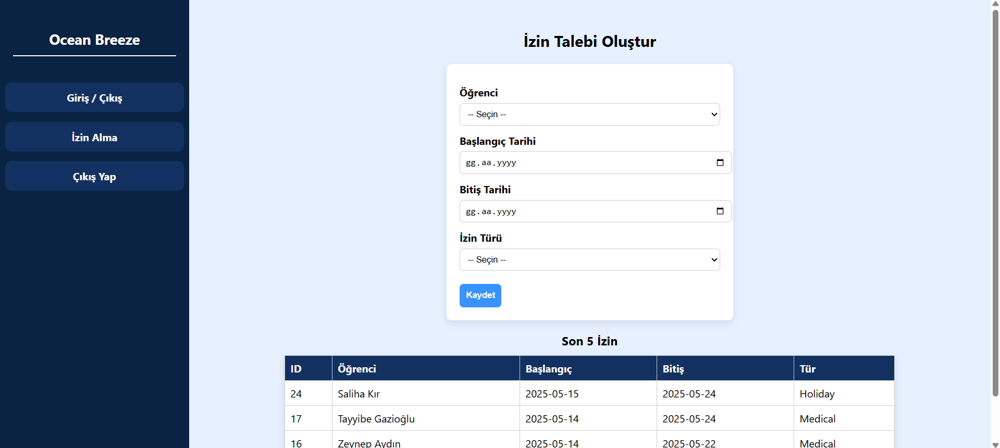
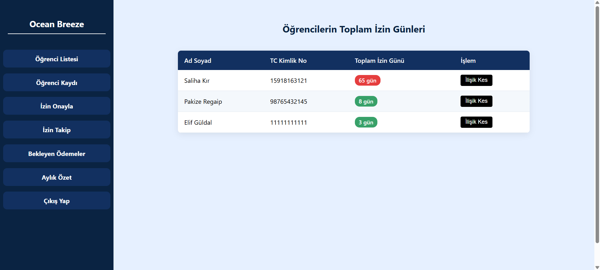

# dormitory_automation 
# Yurt Otomasyon Sistemi - Ocean Breeze

Ocean Breeze, bir öğrenci yurdunun giriş-çıkış, izin ve ödeme süreçlerini web tabanlı olarak yöneten PHP/MySQL tabanlı bir uygulamadır.

## Özellikler           

*  ### **Kimlik Doğrulama & Yetkilendirme**
  
  
  
  *  -`security` ve `students_affair` rollerine özel güvenli giriş.

	
   

* ### **Giriş/Çıkış Takibi**           
  
  
  *  -Çift giriş/çıkış önlenir; her işlem zaman damgasıyla kaydedilir.


* ### **İzin Yönetimi**:            
  
  
  
  
  * -Öğrenciler izin talep edebilir; personel bekleyen talepleri onaylayabilir veya silebilir. 45 günden fazla izin kullanmış öğrenciler takip edilir.


* ### **Fatura & Ödeme Modülü**:     
  
  
  
  
  * -Öğrencilerin yurt ödemeleri takip edilir; aylık olarak fatura oluşturulur; yeni kayıtlarda o ayın faturası otomatik olarak fatura oluşturma.


* ### **Öğrenci ekleme**:
  
  
  *  -Yeni öğrenci kaydı yapılır.
 
* ### **Öğrenci listeleme**:
  
  
  *  -Kayıtlı olan öğrencilerin bilgileri görüntülenir.


* ### **Öğrenci oda takibi**:
  
  
  *  -Öğrenci yeni eklendiğinde oda ve yatak nosu atanır; isteğe göre oda değişikliği yapılır.


## Teknolojiler

* **Backend**: PHP (PDO)
* **Veritabanı**: MySQL 8.0
* **Frontend**: HTML, CSS,
* **IDE**: Visual Studio Code
* **Yerel Sunucu**: XAMPP (Apache + MySQL)
* **Versiyon Kontrol**: Git & GitHub

## Gereksinimler

* PHP 7.4 veya üzeri
* MySQL 8.0
* XAMPP (ya da benzer LAMP/WAMP)
* Git

## Kurulum

1. **Veritabanı Oluşturun**  
   - phpMyAdmin’e giriş yapın.  
   - “Yeni” → veritabanı adı olarak `dormitory_database` yazıp **Oluştur**’a tıklayın.

2. **SQL Dosyalarını İçe Aktarın**  
   - Sol menüden `dormitory_database`’ı seçin.  
   - Üstteki **İçe Aktar**(**import**) sekmesine gidin.  
   - `dormitory_database.sql` dosyasını seçin ve **Git** e basın
   - Böylece tablo yapısı ve başlangıç verileriniz yüklenecek.

3. **Yapılandırma Dosyasını Güncelleyin**  
   - `config/db.php` içindeki şu satırları kendi ayarlarınıza göre düzenleyin:
     ```php
     $host = '127.0.0.1';
     $port= 3307;                     // XAMPP’in MySQL portu  
     $dbname = 'dormitory_database';  // Veritabanı adı
     $user = 'root';                  // kullanıcı adı
     $pass = '';                      // Şifre XAMPP için genelde boş olur 
     ```
   - Eğer MySQL port’unuz farklıysa `3306` gibi veya phpMyAdminde XAMPP değilde workbench kullanıyorsanız:
     ```php
     $host = 'localhost';
     $port= 3306;                     // MySQL’in portu  
     $dbname = 'dormitory_database';  // Veritabanı adı
     $user = 'root';                  // Kullanıcı adı
     $pass = '';                      // MySQL şifreniz
     ```
       
   
4. **Projeyi Çalıştırın**  
   - Tüm dosyalar XAMPP’in `htdocs/dormitory_automation/` klasörüne kopyalanmış olmalı.  
   -  Tarayıcıda `http://localhost/dormitory_automation/public/login.php` adresine gidin.
   -  Her şey doğruysa uygulama giriş ekranını ve panelleri göreceksiniz!

5. **Varsayılan Kullanıcılar**  
   - **Güvenlik** rolüyle:  
     - TC: `12345678901`, şifre: `123456`  
   - **Öğrenci İşleri** rolüyle:  
     - TC: `12345678932`, şifre: `29sude`  


## Proje Yapısı

```
├── assets/                # Görseller, stiller  
├── config/                # Veritabanı bağlantı ayarları
│   └── db.php             # PDO ile bağlantı yapılandırması
├── enter_leave/           # Giriş/çıkış sayfası
├── includes/              # Sidebar navigasyon modülü
├── payments/              # Fatura ve ödemelerle ilişkili modülleri
├── permissions/           # İzinlerle ilişkili modülleri
├── public/                # Giriş ve dashboard sayfaları
└── students/              # Öğrenci kayıt, listeleme ve yatak atama modülleri

```
